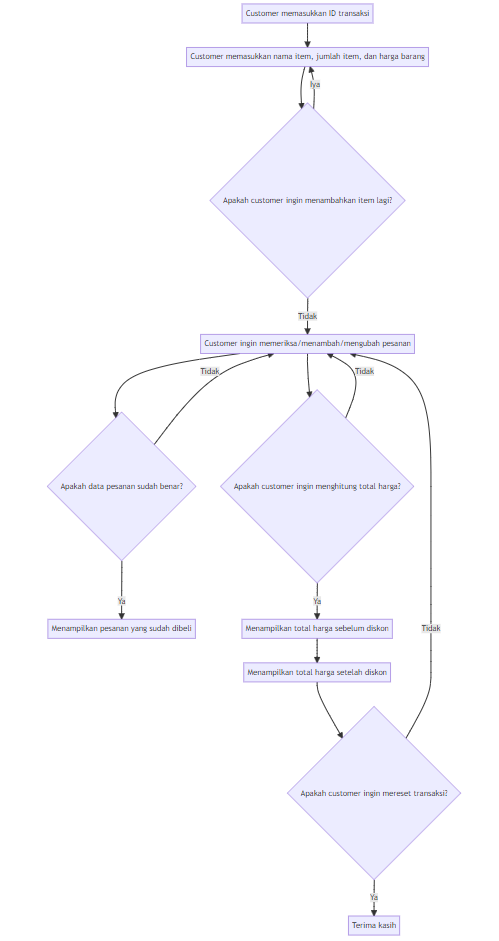

# Kasir Self-Service Supermarket

- [Kasir Self-Service Supermarket](#kasir-self-service-supermarket)
- [Gambaran Fitur](#gambaran-fitur)
- [Penjelasan Kelas dan Metode](#penjelasan-kelas-dan-metode)
  - [Kelas `Transaction`](#kelas-transaction)
    - [Metode](#metode)
- [Fitur Tambahan](#fitur-tambahan)
- [Pedoman Pengembangan](#pedoman-pengembangan)
- [Flowchart](#flowchart)

Proyek ini bertujuan untuk membuat sistem kasir self-service untuk sebuah supermarket. Sistem ini memungkinkan pelanggan untuk memasukkan item yang ingin mereka beli, beserta jumlah dan harga setiap item. Sistem ini menyediakan berbagai fitur untuk memperbarui, menghapus, dan memeriksa pesanan pelanggan, serta menghitung total harga. Selain itu, sistem ini juga memberikan fleksibilitas untuk menambahkan fitur lain sesuai kebutuhan.

# Gambaran Fitur
Berikut adalah fitur-fitur yang diimplementasikan dalam program ini:

- Kelas `Transaction` : Menciptakan objek transaksi baru untuk pelanggan.
- `add_item(item_details)` : Menambahkan item ke transaksi dengan nama, jumlah, dan harga yang ditentukan.
- `update_item_name(old_name, new_name)` : Memperbarui nama item yang sudah ada dalam transaksi.
- `update_item_qty(item_name, new_qty)`: Memperbarui jumlah item yang sudah ada dalam transaksi.
- `update_item_price(item_name, new_price)`: Memperbarui harga item yang sudah ada dalam transaksi.
- `delete_item(item_name)`: Menghapus item dari transaksi.
- `reset_transaction()`: Menghapus semua item dari transaksi.
- `check_order()`: Memvalidasi pesanan pelanggan dan menampilkan detail transaksi.
- `total_price()`: Menghitung total harga dari transaksi, dengan mempertimbangkan diskon yang berlaku berdasarkan total belanja.

# Penjelasan Kelas dan Metode
## Kelas `Transaction`
Kelas ini mewakili transaksi pelanggan dan menyediakan metode untuk mengelola item serta melakukan perhitungan.

### Metode

`add_item(item_details)`
Menambahkan item ke transaksi dengan nama, jumlah, dan harga yang ditentukan.

- `item_details`: Sebuah daftar yang berisi nama item, jumlah, dan harga dalam format `[<nama item>, <jumlah>, <harga>]`.

`update_item_name(old_name, new_name)`
Memperbarui nama item yang sudah ada dalam transaksi.

- `old_name`: Nama item yang saat ini.
- `new_name`: Nama baru yang akan diberikan pada item tersebut.

`update_item_qty(item_name, new_qty)`

Memperbarui jumlah item yang sudah ada dalam transaksi.

- `item_name`: Nama item yang ingin diperbarui.
- `new_qty`: Jumlah baru yang akan diberikan pada item tersebut.

`update_item_price(item_name, new_price)`

Memperbarui harga item yang sudah ada dalam transaksi.

- `item_name`: Nama item yang ingin diperbarui.
- `new_price`: Harga baru yang akan diberikan pada item tersebut.

`delete_item(item_name)`
Menghapus item dari transaksi.

- `item_name`: Nama item yang ingin dihapus.

`reset_transaction()`
Menghapus semua item dari transaksi.

`check_order()`
Memvalidasi pesanan pelanggan dan menampilkan detail transaksi. Mengembalikan pesan yang menunjukkan adanya kesalahan jika ditemukan.

`total_price()`
Menghitung total harga dari transaksi, dengan mempertimbangkan diskon yang berlaku berdasarkan total belanja. Mengembalikan total harga setelah diskon diterapkan.

# Fitur Tambahan
Sesuai permintaan Andi, fitur tambahan dapat ditambahkan berdasarkan kebutuhan khusus dari supermarket. Beberapa ide fitur tambahan yang mungkin adalah:

Implementasi antarmuka pengguna (UI) atau antarmuka baris perintah (CLI) untuk berinteraksi dengan program.
Penyimpanan dan pengambilan transaksi dari file atau database untuk mencatat riwayat transaksi.
Dukungan untuk beberapa mata uang atau konversi mata uang.
Pembuatan struk pembelian atau faktur untuk pelanggan.

# Pedoman Pengembangan
Untuk memastikan kesuksesan proyek, ikuti pedoman pengembangan berikut:

- Tulis kode modular yang memisahkan komponen yang berbeda ke dalam fungsi atau kelas yang sesuai.
- Ikuti pedoman PEP8 untuk format dan gaya penulisan kode yang bersih.
- Sertakan docstring untuk memberikan dokumentasi pada kelas dan fungsi, -menjelaskan tujuan dan penggunaannya.
- Implementasikan penanganan error yang baik menggunakan blok try-except untuk memudahkan pelacakan dan penanganan kesalahan.
- Manfaatkan pustaka atau metode Python, seperti NumPy, untuk perhit

# Flowchart

